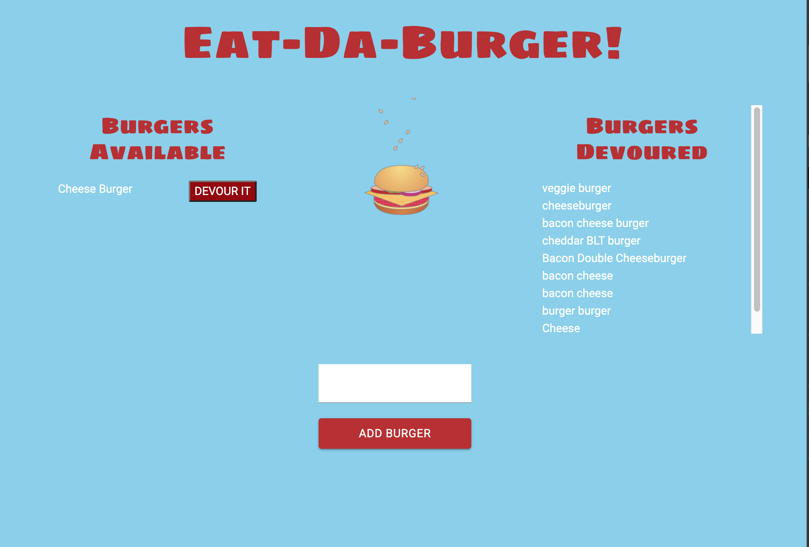

Eat Da Burger
## Table of Contents
  * [Description](#Description)
  * [Questions](#Questions)

## Description
A restaurant application that lets users input the names of burgers they'd like to eat. Whenever a user submits a burger's name, your app will display the burger on the left side of the page -- waiting to be devoured.  Each burger in the waiting area also has a `Devour it!` button. When the user clicks it, the burger will move to the right side of the page.

## Instructions
1. Clone this github.
2. Add all npm dependancies listed in package.json file

Team Profile Generator GitHub Repo: 
https://github.com/dorykahale/Eat-Da-Burger

  ## Questions
  Contact Information
  Github [dorykahale](https://github.com/dorykahale)
  Email: dorykahale@gmail.com
